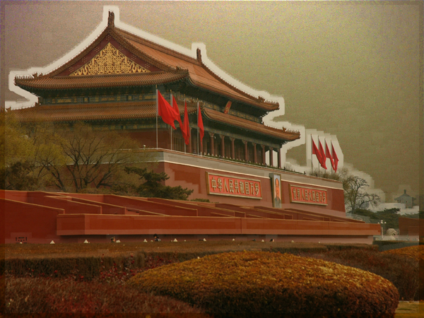

# DarkChannelPriorDehazing
This is an implementation of image dehazing by dark channel prior.

The code does not implement soft matting

Tang, Xiaoou . "Single Image Haze Removal Using Dark Channel Prior." 2009 IEEE Conference on Computer Vision and Pattern Recognition IEEE, 2009.

